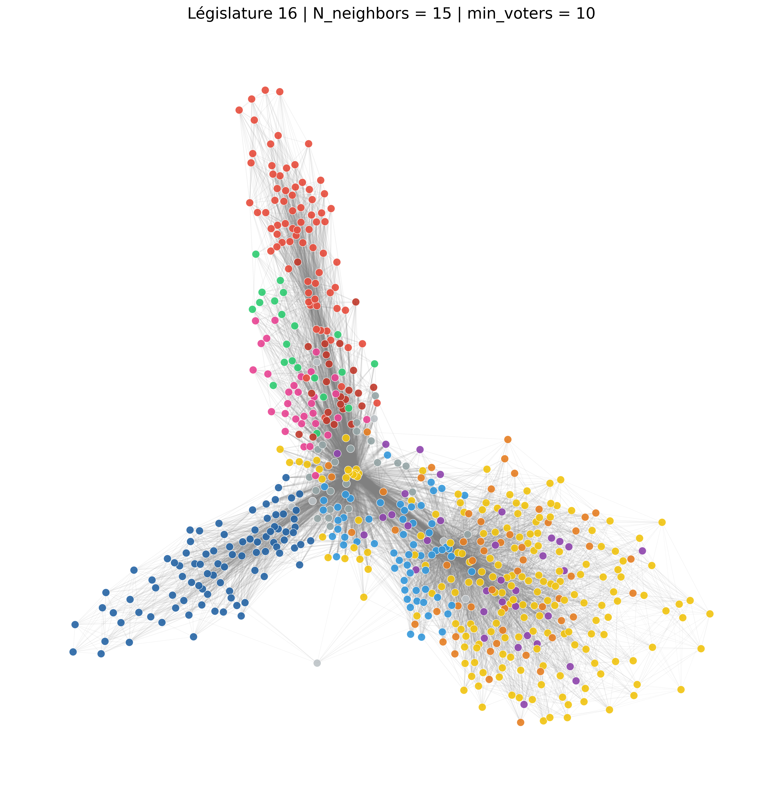

# Networks-Analysis
This project uses Graph Theory to analyze voting patterns in the French National Assembly. By treating MPs as nodes and shared votes as edges, we reveal the hidden mathematical structure of political life, moving beyond simple party labels.

---

## Visual Results (Jaccard Index)

| 15th Legislature (2017-2022) | 16th Legislature (2022-2024) |
| :---: | :---: |
|  |  |

Our analysis reveals a significant structural shift:
* **Pre-2022 (15th):** A highly centralized network dominated by a monolithic presidential majority.
* **Post-2022 (16th):** A more fragmented assembly split into **three distinct poles**. 

We observe a decrease in "bridge" MPs—individuals who traditionally acted as pivots between different political families.

### Next Steps: Centrality Analysis
To quantify this phenomenon, we will extend this project by implementing **Betweenness Centrality** measures.

> **Betweenness Centrality** measures the extent to which a node (MP) lies on the shortest paths between other nodes. In a political context, it identifies "brokers" or "gatekeepers"—MPs who are essential for building cross-party majorities, even if they aren't the most "popular" or similar to everyone else.

---

## Mathematical Methodology

The core of this project lies in how we measure the distance between two MPs. Given a voting matrix where each row is an MP and each column a vote, we define $x_i$ and $x_j$ as the voting vectors for two MPs.

While Centered Cosine and Pearson Correlation share the same base formula, they differ in how they handle missing data (absences), providing two distinct perspectives on the Assembly.

### 1. Centered Cosine Similarity (Geometric Approach)
Unlike a standard cosine similarity, we first center the data by subtracting the MP's mean vote ($\bar{x}$) and then **fill missing values with 0**. This centers the "Abstention" at 0 and measures the alignment of intentions.

$$\text{sim}(i, j) = \frac{\sum (x_{ik} - \bar{x}_i)(x_{jk} - \bar{x}_j)}{\sqrt{\sum (x_{ik} - \bar{x}_i)^2} \sqrt{\sum (x_{jk} - \bar{x}_j)^2}}$$

* **Insight**: It captures the "direction" of political thought.

* **Data Handling**: By filling NaNs with 0, MPs with low participation rates end up with "shorter" vectors.
* **Graph Insight**: These MPs are naturally pushed to the **periphery** of the network by the force-directed algorithm. This approach maps the "spatial footprint" of an MP's activity.

### 2. Pearson Correlation (Statistical Approach)
Pearson measures the linear correlation between two voting behaviors. It is particularly efficient at identifying **party discipline**. Our implementation uses the standard Pearson coefficient, which performs **pairwise deletion** of missing values (NaNs are ignored rather than replaced).

$$\rho_{i,j} = \frac{\text{cov}(x_i, x_j)}{\sigma_i \sigma_j}$$

* **Data Handling**: It only considers sessions where **both** MPs were present, regardless of their overall attendance record.
* **Graph Insight**: It measures **pure synchronization**. It is the gold standard for identifying party discipline and ideological alignment, as it isn't "diluted" by absences.

### 3. Jaccard Index (Modified for Votes)
We use this to measure **active cohesion**. It represents the ratio of identical votes over the total number of times at least one of the two MPs was present.

$$J(i, j) = \frac{|x_i \cap x_j|}{|x_i \cup x_j|}$$

* **Insight**: It penalizes "ghost" MPs. If MP $A$ is always absent while MP $B$ votes, their Jaccard similarity will collapse, even if they share the same party label.

### 4. Weighted Agreement
A pure measure of ideological proximity that ignores absences entirely. It only looks at the "clash" when both MPs are in the room.

$$\text{Agreement}(i, j) = \frac{\text{Matching Votes}}{\text{Common Presences}}$$

---

## Project Structure
* `scr/fetcher.py`: Automates the collection of voting data.
* `scr/analyzer.py`: Contains the logic for the 4 similarity metrics above.
* `scr/main.py`: Orchestrates the filtering (e.g., keeping votes with > min_voters) and graph generation.