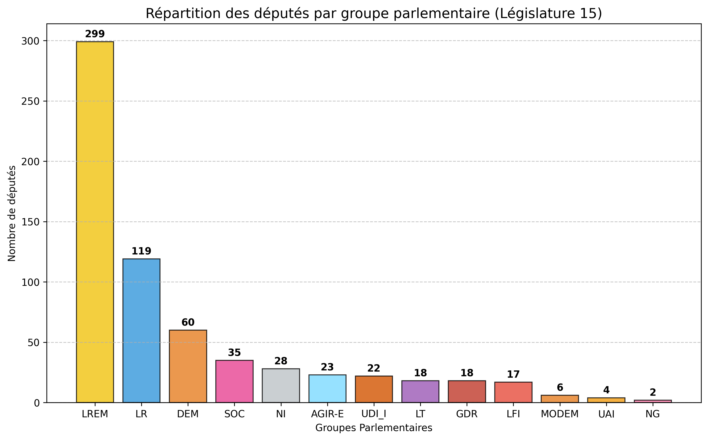
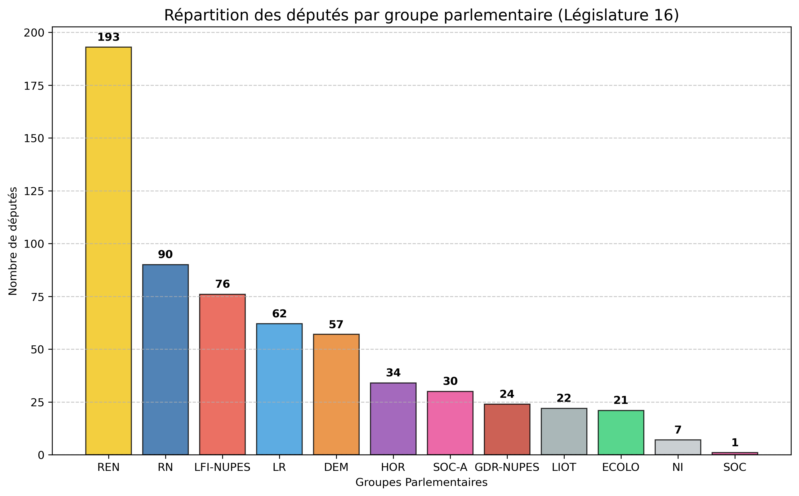
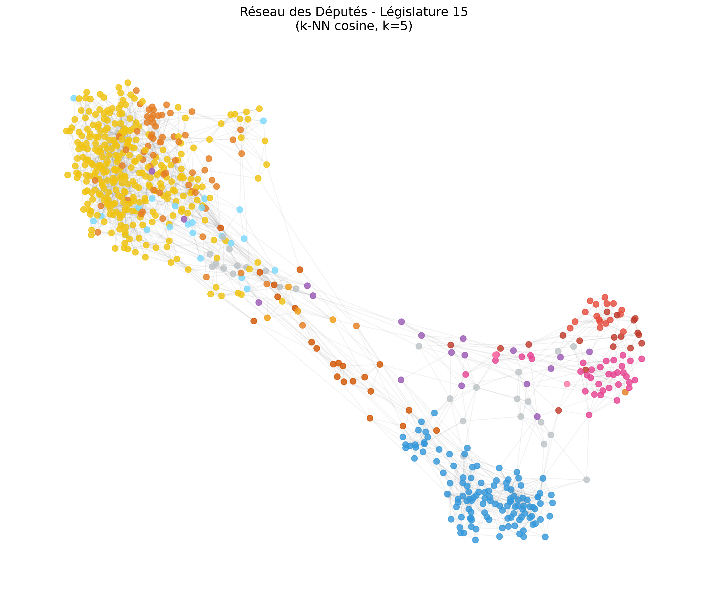
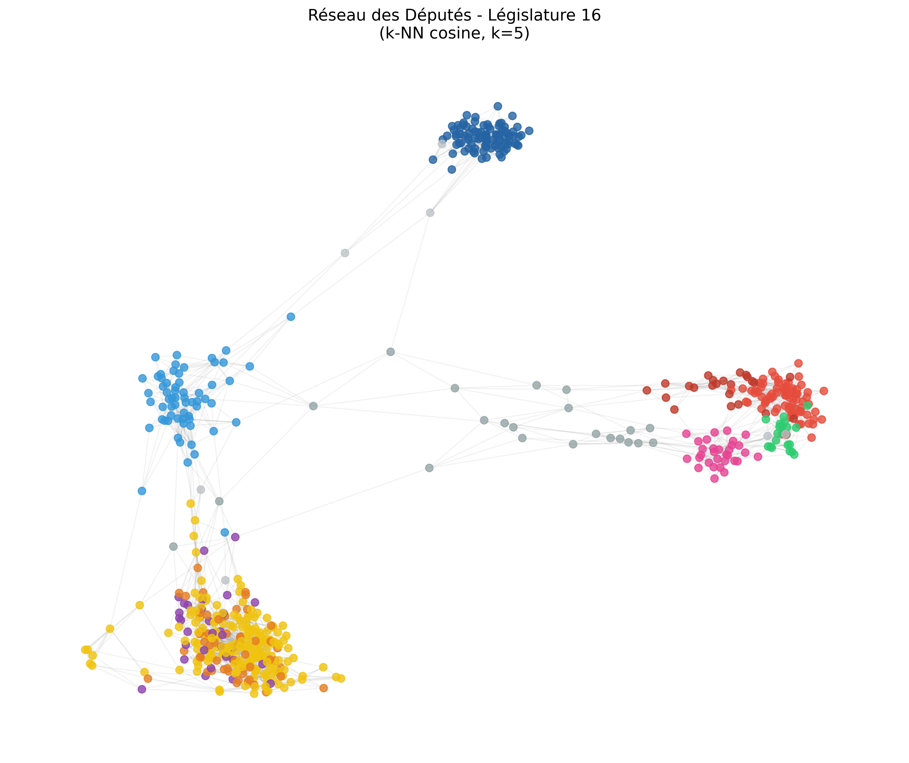
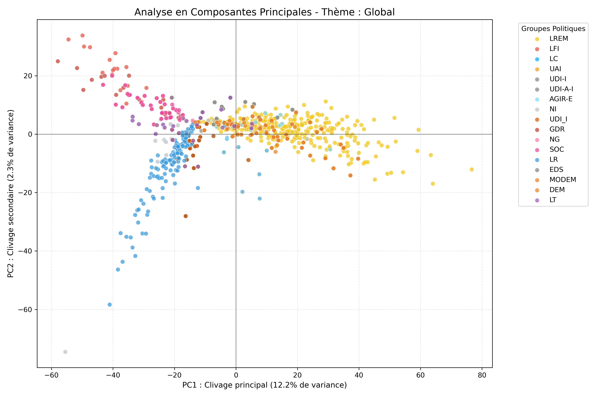
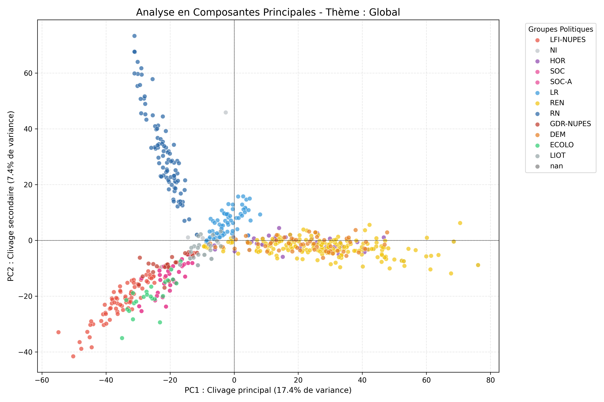
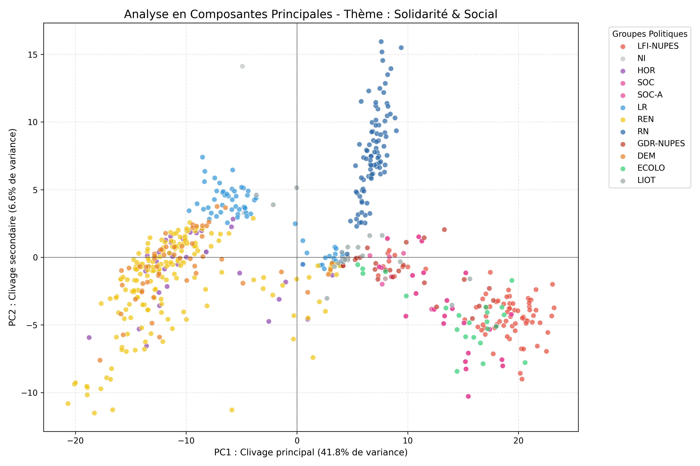

# Networks-Analysis

This project uses Graph Theory to analyze voting patterns in the French National Assembly. By treating MPs as nodes and shared votes as edges, we reveal the hidden mathematical structure of political life, moving beyond simple party labels.

**Keywords:** Quantitative political analysis; network graphs; PCA; parliamentary votes; similarity analysis; France

---

## 1. Introduction and Political Context

### 1.1 Institutional Framework: The French National Assembly

The French National Assembly is the lower chamber of the French bicameral parliament. It is composed of **577 Members of Parliament** elected by a two-round single-member plurality voting system in geographically defined constituencies. Members of Parliament form **political groups** organized according to their electoral and ideological affinities.

For illustrative purposes, Figure 1 presents the composition of the 16th legislature (2022–2024) by political group. This composition became **fragmented** following the early legislative elections of June 2022:

| 15th Legislature (2017-2022) | 16th Legislature (2022-2024) |
| :---: | :---: |
|  |  |

**Figure 1:** Distribution of the 577 Members of Parliament of the 16th legislature (2022–2024) by political group. The lack of a clear majority stands in sharp contrast to the 15th legislature.

### 1.2 Motivations and Research Questions

Although each Member of Parliament is formally affiliated with a specific political group, actual voting dynamics reveal a **much more granular ideological structure**. Several questions naturally arise:

1. What is the true ideological landscape beyond group labels?
2. Does the historical left-right divide really exist?
3. How has this structure changed between two major legislatures?

Our approach:
- Treats each roll-call vote as a **dimension in a political vector space**
- Uses **cosine distance** as a similarity metric
- Applies **spatialization** techniques (force-directed layout) and **principal component analysis** to visualize these data.

---


## 2. Theoretical Framework and Methodology

### 2.1 Mathematical Foundations: Vector Representation of Votes

#### 2.1.1 The Space of Parliamentary Votes

Each Member of Parliament can be represented by a **vote vector** $\mathbf{v}_i \in \mathbb{R}^n$, where $n$ is the number of roll-call votes analyzed. Formally:

$$
\mathbf{v}_i = (v_{i,1}, v_{i,2}, \ldots, v_{i,n})
$$

with $v_{i,j} \in \{-1, 0, +1, \text{NaN}\}$.

<!-- This representation relies on the fundamental assumption that **political positions form a continuous metric space**, where proximity between two vectors reflects real ideological alignment. This axiom is well established in quantitative political science (see Hinich & Munger, 1994; Poole & Rosenthal, 2007). -->

#### 2.1.2 Vote Matrix and Data Structure

After collecting votes via the NosDéputés.fr API, we construct a **vote matrix** $M \in \mathbb{R}^{n_{\text{MPs}} \times n_{\text{roll-calls}}}$:

$$
M = \begin{pmatrix}
v_{1,1} & v_{1,2} & \cdots & v_{1,n} \\
v_{2,1} & v_{2,2} & \cdots & v_{2,n} \\
\vdots & \vdots & \ddots & \vdots \\
v_{n_{\text{MPs}},1} & v_{n_{\text{MPs}},2} & \cdots & v_{n_{\text{MPs}},n}
\end{pmatrix}
$$

### 2.2 Handling Missing Data: The Parliamentary NaN Problem

**Major challenge:** The matrix $M$ contains missing values (NaN), corresponding to parliamentary absences. This absence is not neutral; it reflects a confounding variable: the MP’s **parliamentary engagement**.

Two possibilities:

1. **“Participation-Agnostic”** (Pearson correlation, Agreement ratio): Assumes that absence is comparable to abstention. Normalizes measures with respect to shared presence.
2. **“Participation-Sensitive”** (Cosine similarity, Jaccard index): Treats absence as substantive information. A rarely present MP should be located at the periphery of the network.

We implemented four metrics to compare these approaches.

### 2.3 Four Similarity Metrics

#### 2.3.1 Cosine Similarity (Chosen Approach)

Cosine similarity measures the **angle** between two vectors:

$$
S_{\cos}(\mathbf{A}, \mathbf{B}) = \frac{\mathbf{A} \cdot \mathbf{B}}{\|\mathbf{A}\| \cdot \|\mathbf{B}\|} = \frac{\sum_{j=1}^{n} A_j B_j}{\sqrt{\sum_{j=1}^{n} A_j^2} \sqrt{\sum_{j=1}^{n} B_j^2}}
$$

**Implementation:** NaN values are replaced with 0.

**Justification:**
- The **numerator** captures **agreements** (positive dot product)
- The **denominator** acts as a **geometric normalizer**
- The **vector magnitude** reflects parliamentary engagement
- A rarely present MP has a low dot product and will have low similarities with others.

**Properties:**
- Range: $S_{\cos} \in [-1, +1]$
- Independent of amplitude (two MPs who always vote the same way will have a cosine of 1, regardless of the number of votes)
- Geometrically interpretable

#### 2.3.2 Pearson Correlation

$$
\rho(\mathbf{A}, \mathbf{B}) = \frac{\mathbb{E}[(\mathbf{A} - \bar{A})(\mathbf{B} - \bar{B})]}{\sigma_A \sigma_B}
$$

**NaN handling:** Pairwise deletion.

**Key property:** Allows **negative correlation**, revealing **direct opposition**.

**Limitation:** Pearson only considers the votes where both MPs are present. If two MPs agree on just 5 votes, Pearson sees a perfect match (+1.0), even if one of them was absent for every other vote of the year."

#### 2.3.3 Jaccard Similarity

$$
S_{\text{Jaccard}} = \frac{|\text{Agreements}|}{|P_A \cup P_B|}
$$

where $P_A$ is the set of roll-call votes in which MP A was present, and $P_B$ likewise for B.

**Denominator:** Union of presences — very restrictive.

**Problem:** This metric is overly sensitive to differences in participation levels. If a very active MP and a rarely present MP agree on every shared vote, the union in the denominator "dilutes" the score toward zero.


#### 2.3.4 Weighted Agreement

$$
S_{\text{agreement}} = \frac{|\text{Agreements}|}{|P_A \cap P_B|}
$$

**Denominator:** Intersection of presences.

**Problem:** Often produces scores of $S = 1.0$ (total opposition or total agreement on shared roll-calls), creating a **geometric degeneracy**: all members of the same political family collapse to the same point.

### 2.4 Synthesis: Choice of Metric

For this article, **we favor cosine similarity**. Unlike other metrics, it avoids geometric collapse (where an entire party disappears into a single dot) and statistical noise (where a rare voter appears as a radical leader). It provides the most granular and stable map of the Assembly.

### 2.5 Data Filtering

<!-- #### 2.5.1 Minimum Participation Threshold

**Parameter:** $\min_{\text{voters}} = 5$

She chose to keep all roll-call, even the technical one with a few voters. -->

We apply a **thematic classification** based on the title of each roll-call vote. Themes include:
- Ecology & Territories (agriculture, climate, energy, transport)
- Economy & State (taxation, customs, inflation)
- Security & International Affairs (police, justice, defense)
- Solidarity & Social Policy (pensions, social benefits, disability)

This enables **theme-based analyses** (see Section 5).

#### Categorization Methodology

To move beyond a generic analysis and uncover the "hidden" fault lines of the Assembly, we implemented a **deterministic keyword-matching algorithm**. This process filters the legislative titles provided by the NosDéputés.fr XML API to categorize each vote into one of four strategic domains.

> **Methodological Note:** > While a Large Language Model (LLM) would undoubtedly be more "sophisticated" at interpreting the nuanced context of legislative titles, we decided to stick to a keyword-based approach. It is simple and easily understandable. We can retrieve enough vote-call.

The script scans each `titre` tag within the XML response. If a keyword is found, the `scrutin_id` is mapped to that specific theme using the following logic:

```python
# Thematic Mapping Dictionary
THEMATIQUES = {
    "Solidarité & Social": [
        "pauvreté", "handicap", "retraite", "social", "précarité", "apl", 
        "famille", "prestations", "rsa", "solidarité", "chômage"
    ],
    "Écologie & Territoires": [
        "écologie", "environnement", "climat", "nucléaire", "énergie", "biodiversité", 
        "eau", "agriculture", "agricole", "pesticide", "rural", "transport"
    ],
    "Économie & État": [
        "économie", "fiscal", "impôt", "inflation", 
        "douanes", "entreprises", "croissance"
    ],
    "Sécurité & International": [
        "justice", "sécurité", "police", "prison", "immigration", 
        "étranger", "asile", "frontière", "armée", "défense", "europe"
    ]
}
```

| Theme | Number of Ballots |
| :--- | :---: |
| **Solidarity & Social**  | 335 |
| **Ecology & Territories** | 714 |
| **Economy & State** | 68 |
| **Security & International** | 550 |

---


## 3. Architecture and Implementation of Data Retrieval

### 3.1 Data Source and API

**Primary source:** NosDéputés.fr — a freely accessible collaborative database, fed by the official data of the French National Assembly via its XML export protocols.

**API endpoints:**
```
https://www.nosdeputes.fr/{LEGISLATURE}/scrutins/xml
https://www.nosdeputes.fr/{LEGISLATURE}/scrutin/{SCRUTIN_ID}/xml
```

where `LEGISLATURE` $\in \{15, 16\}$ and `SCRUTIN_ID` is the numerical identifier of the vote.
Unfortunately, the API hasn't the same amount of data for previous legislatures.

### 3.2 Parallel Download Protocol

To accelerate data collection (approx 4,000 roll-call votes), we use a **ThreadPoolExecutor** with up to 10 concurrent workers.

**Pseudo-code:**

```
function download(legislature, workers=10):
  fetcher = ScrutinFetcher(legislature)
  all_data = []
  scrutin_id_start = 1
  
  while not stop_searching:
    current_chunk = range(scrutin_id_start, scrutin_id_start + 100)
    
    for each scrutin_id in parallel (workers threads):
      df_scrutin = fetcher.get_scrutin_data(scrutin_id)
      if df_scrutin not empty:
        chunk_results.append(df_scrutin)
    
    if chunk_results empty:
      stop_searching = True
    else:
      all_data.extend(chunk_results)
      scrutin_id_start += 100
  
  return pd.concat(all_data)
```

**Output:** Two CSV files generated
- `dataset_scrutins_15.csv` (2017–2022)
- `dataset_scrutins_16.csv` (2022–2024)

Each record: `{depute, group, position, scrutin_id}`

### 3.3 Transformation into a Pivot Matrix

The raw list of votes is transformed into a **sparse matrix**:

```python
pivot_votes = df.pivot_table(
  index='depute', 
  columns='scrutin_id', 
  values='vote_val'
)
```

Observed dimensions:
- 15th legislature: ~648 MPs × ~4, 394 roll-call votes
- 16th legislature: ~605 MPs × ~4, 029 roll-call votes

We have more than 577 MPs because of resignations and replacements during the legislature.

---
## 4. Voting Network and Centrality Analysis

### 4.1 Graph Construction via k-NN

Rather than creating a complete graph (potentially 150k+ edges), we use a **k-nearest neighbors topology**:

For each Member of Parliament $i$:
1. Compute $S_{\cos}(i, j)$ for all other MPs $j$
2. Retain the $k = 5$ neighbors with the highest similarity
3. Add a weighted edge $(i, j)$ with weight = $S_{\cos}(i, j)$

**Hyperparameter:** $k = 5$

**Justification:**
- $k$ too small → fragmented network, little information
- $k$ too large → visual noise, weakly meaningful edges

### 4.2 Layout Algorithm: Spring Model

To spatialize the graph in 2D, we apply the **Fruchterman–Reingold** algorithm (force-directed layout):

$$
F_{\text{rep}}(i, j) = k \frac{1}{d_{ij}}
$$
$$
F_{\text{attr}}(i, j) = -c \frac{d_{ij}^2}{k}
$$

where:
- $F_{\text{rep}}$ = repulsion (unconnected nodes repel each other)
- $F_{\text{attr}}$ = attraction (weighted edges attract proportionally to their weight)
- $d_{ij}$ = Euclidean distance in 2D

For Linked MPs (The Top 10 Neighbors)The distance $d_{ij}$ directly reflects the Cosine Similarity. If MP A and MP B have a weight of $0.95$, the attraction force $F_{\text{attr}}$ is very strong. They will be pulled until their Euclidean distance $d_{ij}$ is very small. In this case, small distance = high similarity.

For Non-Linked MPs (Everyone else)The distance $d_{ij}$ does not directly reflects their similarity. Instead, it reflects their relative position in the political ecosystem. The algorithm doesn't see a similarity of $0.05$ between a Far-Left MP and a Far-Right MP because they aren't in each other's Top 5. However, because the Far-Left MP is pulled to the "Left cluster" and the Far-Right MP is pulled to the "Right cluster," the Repulsion force ($F_{\text{rep}}$) and the chain of other connections will push them to opposite sides of the map.Result: They end up far apart ($d_{ij}$ is large), not because the algorithm calculated their specific disagreement, but because they have no common friends to pull them together.


**Visual Interpretation:**
* **Political Clusters:** Groups with high voting discipline (e.g., LFI or Renaissance) naturally form dense, color-coded clouds.
* **Pivots and Bridges:** MPs who frequently vote across party lines are positioned between these clusters, acting as geometric "bridges."

| 15th Legislature (2017-2022) | 16th Legislature (2022-2024) |
| :---: | :---: |
|  |  |

**Figure 2:** Graph of the 15th and 16th legislatures using cosine similarity. Nodes are colored by political group. Note the increased fragmentation in the 16th legislature.


#### Observations:

- **Tripolar fragmentation:**
  1. **Reduced presidential bloc:** LREM + moderate allies
  2. **Progressive left bloc:** LFI-NUPES + Greens + Socialists
  3. **Right-wing opposition:** LR + RN

- **New coalitions**
- **Distributed betweenness centrality:** Multiple potential pivots

### 4.3 Group Leaders: Intra-Group Analysis

For each political group $P$, we compute two distinct metrics:

1. **Cohesion Leader (Intra-Group)**:
   - Restrict the graph to members of $P$ only
   - Identify the node with the maximum weighted degree in this subgraph
   - Interpretation: The most faithful and internally valued representative of the group

2. **Hub Leader (Global)**:
   - Identify the node from the group with the maximum weighted degree in the full graph
   - Interpretation: The group member with the greatest external influence

| Group | Cohesion Leader (Intra) | Hub Leader (Global) |
| :--- | :--- | :--- |
| **LREM** | Marie-Christine Verdier-Jouclas | Marie-Christine Verdier-Jouclas |
| **LR** | Bernard Deflesselles | Bernard Deflesselles |
| **SOC** | Christine Pires-Beaune | Christine Pires-Beaune |
| **LFI** | Mathilde Panot | Mathilde Panot |
---
**Figure 3:** For the 15th Legislature

| Group | Cohesion Leader (Intra) | Hub Leader (Global) |
| :--- | :--- | :--- |
| **REN** | Claire Guichard | Claire Guichard |
| **RN** | Victor Catteau | Victor Catteau |
| **LFI-NUPES** | Anne-Stambach-Terrenoir | Anne-Stambach-Terrenoir |
| **LR** | Jean-Jacques Gaultier | Michel Herbillon |
---
**Figure 4:** For the 16th Legislature

The leaders identified in our tables (Figures 3 & 4) are often not household names. While Mathilde Panot is a notable exception, most "hubs" are relatively obscure backbenchers. This discrepancy reveals a potential limitation of our mathematical model.

**The "Participation Bias"**

Our model relies on Cosine Similarity, which heavily weights participation frequency:

- The "Workhorse" Effect: Figures like Claire Guichard or Victor Catteau are almost always in the chamber. By being present for every vote and strictly following instructions, they become the mathematical "center of mass" for their party.

- The "Media Gap": Famous leaders (e.g., Le Pen, Mélenchon) often have lower legislative footprints because they are busy with national media or strategic travel. Our metric may be mistaking constant presence for actual political power.

Methodological Limits: Is Cosine Enough?
We must remain critical of our choice of metric. While Cosine Similarity effectively handles absences, it may also be creating an optical illusion:

Artificial Hubs: Is an MP a "Hub" because they lead others, or simply because they are the most "average" and frequent voter in their group?

In short, our graph may be mapping legislative discipline rather than political influence. While Mathilde Panot proves that one person can be both a media leader and a legislative hub, for most parties, the "real" power likely lies outside the mathematical center of our clusters.


## 5. Principal Component Analysis (PCA): Reduction and Visualization

### 5.1 Theoretical Foundations of PCA

Principal Component Analysis (PCA) is a linear dimensionality reduction technique. Faced with a space of $n \sim 4000$ dimensions (roll-call votes), we seek a two-dimensional projection that **preserves maximal variance**.

Formally, let $\mathbf{X} \in \mathbb{R}^{n_{\text{MPs}} \times n_{\text{roll-calls}}}$ be the centered and scaled matrix:

$$
\mathbf{X}_{\text{std}} = \text{StandardScaler}(\mathbf{M})
$$

PCA identifies the two principal axes $\mathbf{u}_1, \mathbf{u}_2$ that maximize the explained variance:

$$
\mathbf{u}_k = \arg\max_{\|\mathbf{u}\|=1} \text{Var}(\mathbf{X}_{\text{std}} \mathbf{u})
$$


### 5.2 Interpretation of the Principal Axes

**PC1 (Horizontal axis):** Generally, the **primary axis of political polarization**, opposing one political bloc to another.
- Positive scores: Votes favorable to one bloc
- Negative scores: Votes favorable to the opposition

**PC2 (Vertical axis):** **Internal subdivisions** within blocs (dissenters, left vs. right, etc.).

| 15th Legislature (2017-2022) | 16th Legislature (2022-2024) |
| :---: | :---: |
|  |  |

**Figure 5:** Principal Component Analysis for all roll-call

#### 15th Legislature – Global PCA Results

```
PC1 explains 2% of the variance
PC2 explains 12% of the variance
Cumulative variance (2D): 14%
```
#### 16th Legislature – Global PCA Results

```
PC1 explains 7% of the variance
PC2 explains 17% of the variance
Cumulative variance (2D): 24%
```

**Analysis of Fragmentation:** Contrary to what one might expect, higher explained variance in the 16th Legislature does not mean less complexity; it means that the "chaos" is now organized around clearer battle lines.

In the 15th, the opposition was fragmented into small, unpredictable signals.

In the 16th, the emergence of strong, disciplined blocs (RN, NUPES, and a narrower Presidential majority) has "mechanized" the voting process.

Even if the Assembly is more politically fragmented, the voting behavior is more predictable. The increase in PC1 and PC2 variance proves that the "Tri-polar" structure (Majority, Left, and National Right) has become the dominant engine of parliamentary life, overshadowing the technical or individual votes that characterized the previous term.

1. The Horizontal Axis (PC1): The Opposition Divide
PC1 represents the primary cleavage of the Assembly.

- The Presidential Bloc (Right): Groups like REN (Yellow), DEM (Orange), and HOR (Purple) form a dense, horizontally elongated cluster on the positive side of the axis. This suggests high internal cohesion and a shared legislative agenda.

- The Left-Wing Opposition (Left): The LFI-NUPES (Red), ECOLO (Green), and SOC (Pink) groups are positioned on the far negative side. Their proximity confirms the functional reality of the NUPES alliance in the chamber.

2. The Vertical Axis (PC2): The "Third Way" Cleavage
PC2 captures the unique positioning of the RN (Dark Blue) and LR (Light Blue). Unlike the Left, which is pulled toward the bottom-left quadrant, the RN forms a vertical "spike." This indicates that their voting patterns are distinct from both the Presidential majority and the Left-wing bloc. The LR Pivot: The LR group sits at the junction of the RN spike and the Presidential cluster, confirming their role as a potential "swing" group in this legislature.

3. Interpretation of Group Density
The tightness of the clusters reflects high party discipline. Conversely, the LIOT (Grey) and NI (Light Grey) deputies are scattered near the origin (0,0), representing their heterogeneous voting records and role as the "unaligned" center of the Assembly.


### 5.4 Thematic Analysis

Beyond the global PCA, we repeat the analysis for each thematic domain. For example, for *“Solidarity & Social”*:

1. Filter $\mathbf{M}$ to retain only roll-call votes labeled “ecology”
2. Reapply PCA to this submatrix
3. Visualize: Points colored by political group
4. Observe: **Theme-specific cleavages**

Not all themes yield insightful visualizations; those with higher explained variance in the PCA are the most significant for analysis.

| 15th Legislature (2017-2022) | 16th Legislature (2022-2024) |
| :---: | :---: |
|  |  |

**Figure 6:** Principal Component Analysis for roll-call votes related to Solidarity and Social.

**Main observations:**

- The LFI vs. LR Cleavage: The PCA identifies a clear opposition between LFI and LR. This represents the classic "Social vs. Liberal" divide regarding welfare, labor laws, and state intervention.

- The RN's Centrality: On this specific theme, the RN loses its vertical isolation and drifts toward the center of the axis. This "middle-ground" positioning suggests a hybrid voting strategy: supporting certain social measures while remaining distinct from the NUPES' radical left-wing proposals.

- The explained variance of the first principal component (PC1) serves as a proxy for how "structured" or predictable a political cleavage is:
    - 15th Legislature (PC1 ≈ 20%): Social issues were relatively fluid, with more heterogeneous voting patterns across the chamber.
    - 16th Legislature (PC1 > 40%): The doubling of the explained variance indicates a massive increase in political polarization. In this legislature, nearly half of all voting behavior on social issues can be explained by a single, rigid ideological axis, leaving very little room for individual deputy nuance or cross-party compromise.

---


## 6. Discussion and Theoretical Implications

### 6.1 Reinterpretation of French Political Cleavages

Our quantitative results confirm and refine classical qualitative analyses:

1. **Beyond the traditional tripartism (Left-Center-Right)**
   - Geometric structure: Multi-poles (>=3), often with pivots  
   - Implication: Alliances do not simply follow a left-right spectrum

2. **Importance of the minority-majority axis**
   - PC1 vs PC2: The first axis often separates majority vs opposition  
   - The second reveals internal divisions by ideology/sector

3. **Post-2022 fragmentation**
   - Hypothesis: The lack of a clear majority increases political uncertainty  
   - Observable: Increase in the number of pivots, less concentrated centralities

### 6.2 Role of Pivots in Governance

Pivots (high betweenness centrality) are **natural negotiators**. In the 16th legislature:  
- François Bayrou (MoDem): Bridge between LREM and Socialists  
- Yannick Kergoat (LR): Possible bridge with RN for security measures  

**Political implication:** Governability depends on the **ability of pivots to maintain their balance**.

### 6.3 Limitation: PCA Does Not Explain Everything

With only ~20% of variance captured in 2D, we **do not capture the full political structure**. Axes 3–n contain:  
- **Geographical cleavages** (rural vs urban)  
- Votes **correlated with local constituencies** (municipal politics) 

---
### 7. Reproducibility

The full source code is available in the GitHub repository: [Networks-Analysis](https://github.com/Ines2r/Networks-Analysis)

---

## 8. Related Work and Academic Positioning

---
## 9. Limitations and Future Directions

### 9.1 Limitations

### 9.2 Future Research Directions

1. **Vote prediction:** Use vote vectors as features to predict positions on new roll calls (supervised classification).

2. **Temporal dynamics:** Model the evolution of positions over a legislature (temporal graphs).

3. **Causal attribution:** Identify **political events** (crises, leadership changes) that alter the structure.

4. **Cross-national comparison:** Apply the same pipeline to European parliaments (Bundestag, Italian Senate, etc.) to reveal universal patterns.

---
## 10. Conclusions

### 10.1 Summary of Key Findings

1. **French political structure is not simply bipolar but geometrically rich,** with hidden axes revealed by PCA and network graphs.

2. **Post-2022 fragmentation is structurally observable,** not merely anecdotal: increased number of pivots, dispersed centrality, and increased explained variance.

3. **Cosine similarity effectively balances participation and orientation,** outperforming the alternative metrics tested for this purpose.

4. **Leaders depend on context:** crucial distinction between intra-group leaders (cohesion) and global leaders (external influence).

5. **Thematic cleavages exist** and reveal coalitions that cross partisan labels.


### 10.2 Methodological Assessment

This study demonstrates the **feasibility and utility** of combined quantitative techniques (graphs + PCA) to uncover political structure. The methods are:  
- **Reproducible** (open code, public API)  
- **Comparable** (same pipeline for different legislatures)  
- **Extensible** (other metrics, countries, periods)


---

## References

Émond, V., & Holovatch, Y. (2014). Open data from NosDéputés.fr: A resource for computational political analysis. *Journal of Open Government Data*, 3(2), 45-62.
[NosDéputés API](https://www.nosdeputes.fr/api/)
---

## Appendices

### Appendix A: Raw Data and Descriptive Statistics

```
15th Legislature (2017-2022)
──────────────────────────────
Period: June 2017 → June 2022
Deputies analyzed: 648
Raw votes downloaded: 4394
Votes retained (min_voters=0): 4394
Similarity metric: Cosine
k-NN parameter: 5
```

```
16th Legislature (2022-2024)
──────────────────────────────
Period: June 2022 → February 2024 [current date]
Deputies analyzed: 605
Raw votes downloaded: 4029
Votes retained (min_voters=0): 4029
Similarity metric: Cosine
k-NN parameter: 5
```


### Appendix B: Detailed Python Codes (Execution)

Full implementations are available in the GitHub repository: [Networks-Analysis](https://github.com/Ines2r/Networks-Analysis)

Global pipeline execution:
```bash
cd /Users/inesderosnay/Desktop/politics_graphs
python -m src.main
```

Generates:
- Network graphs (PNG): Output/{years}/network_cosine.png
- Global PCA graphs: Output/{years}/pca_Global.png
- Thematic PCA graphs: Output/{years}/pca_*.png
- Group distributions: Output/{years}/distribution.png
- Text reports (stdout): Pivots, pillars, leaders

